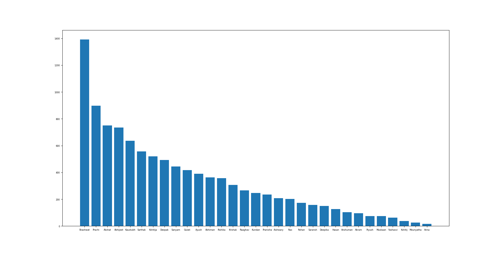
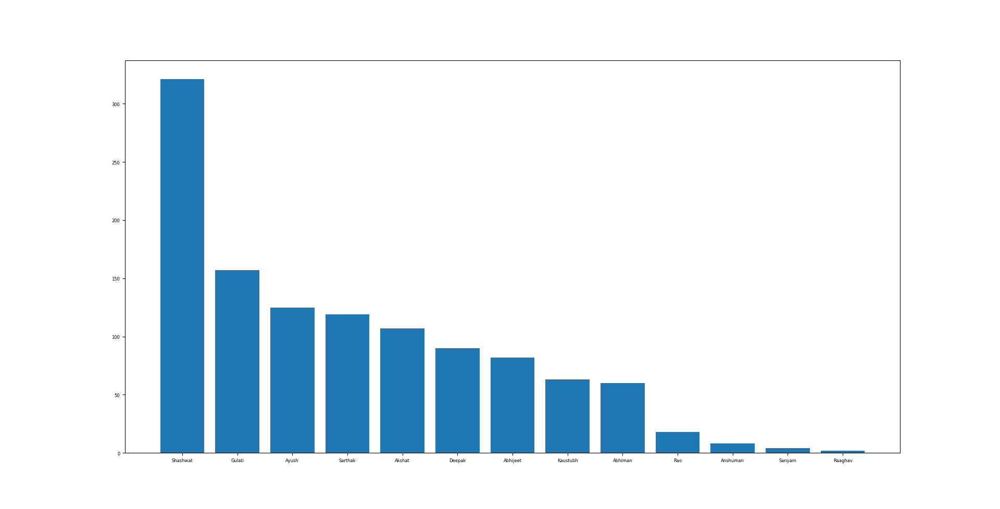
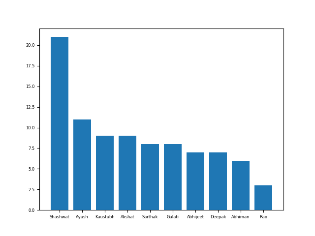

# whatsapp-plot

Plots for how often who talks. On Whatsapp.

# Usage

1. Download the chat. Head on to the required chat on Whatsapp app. Click the three dots in top right corner, export chat, without media. Unfortunately, this feature is unavailable in Whatsapp Web.

2. Rename contacts as you would want in the plot.

3. `python plot_chat.py filename`. Generates plot as such. Script also outputs number of messages per person. An anonymised version is made available as `chat.txt`.

4. You can also view media upload distribution. Unavailable in anonymized version for privacy.

* Another chat:

* Media distribution for second chat

## ToDo

- [X] See how often who uploads media. Useful in meme groups. Just simple track of `<Media omitted>`.
- [ ] Daywise trends?

## Acknowledgements

Thanks to Abhijeet Ghawade for this idea, and providing initial code for this project.

## License

The MIT License (MIT) 2018 - [Kaustubh Hiware](https://github.com/kaustubhhiware). Please have a look at the [LICENSE.md](LICENSE.md) for more details.

Have an issue or suggestion? Make an [issue](https://github.com/kaustubhhiware/whatsapp-plot/issues/new) about it.